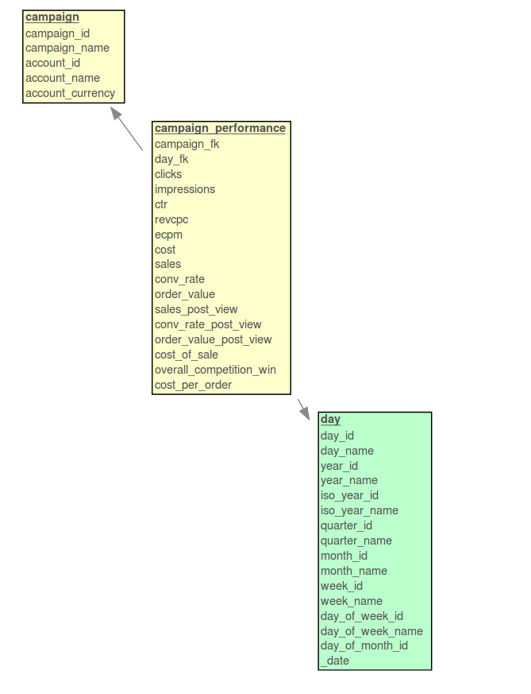

# Criteo Performance Pipeline

A small [mara data integration pipeline](https://github.com/mara/data-integration) that incrementally loads the files downloaded by the [mara Criteo performance downloader](https://github.com/mara/criteo-performance-downloader) into a PostgreSQL data warehouse and transforms the data into a dimensional schema.


## Resulting data

The pipeline (defined in [criteo_performance_pipeline/__init__.py](criteo_performance_pipeline/__init__.py)) creates a database schema `cr_dim` that contains a `campaign_performance` fact table with the dimensions `time` and `campaign`:

 

&nbsp;

This is an example row of the fact table:

```sql
select * from cr_dim.campaign_performance where sales > 0 order by random() limit 1;
-[ RECORD 1 ]-----------+---------
campaign_fk             | 683277
day_fk                  | 20180925
clicks                  | 736
impressions             | 166373
ctr                     | 0.48
revcpc                  | 0.28
ecpm                    | 1.34
cost                    | 223.45
sales                   | 19
conv_rate               | 2.39
order_value             | 1321.75
sales_post_view         | 30
conv_rate_post_view     | 0.02
order_value_post_view   | 3424.08
cost_of_sale            | 13.78
overall_competition_win | 0.0036
cost_per_order          | 11.76
```

See [Criteo Reporting Information](https://support.criteo.com/hc/en-us/articles/209273149-How-do-I-call-the-reporting-information-using-the-Criteo-API-) in the "ReportJob" type section for a documentation of the metrics.

&nbsp;


## Getting started

Add 

```
-e git+git@github.com:mara/criteo-performance-pipeline.git@1.0.0#egg=criteo_performance_pipeline
```

to the `requirements.txt` of your mara project. See the [mara example project](https://github.com/mara/mara-example-project) for details.
 
Make sure that your ETL contains the [etl_tools/create_time_dimensions/](https://github.com/mara/etl-tools/blob/master/etl_tools/create_time_dimensions/__init__.py) pipeline for creating the `time.day` dimension.

Then add the pipeline to your ETL with

```python
import criteo_performance_pipeline

my_pipeline.add(criteo_performance_pipeline.pipeline)
```


